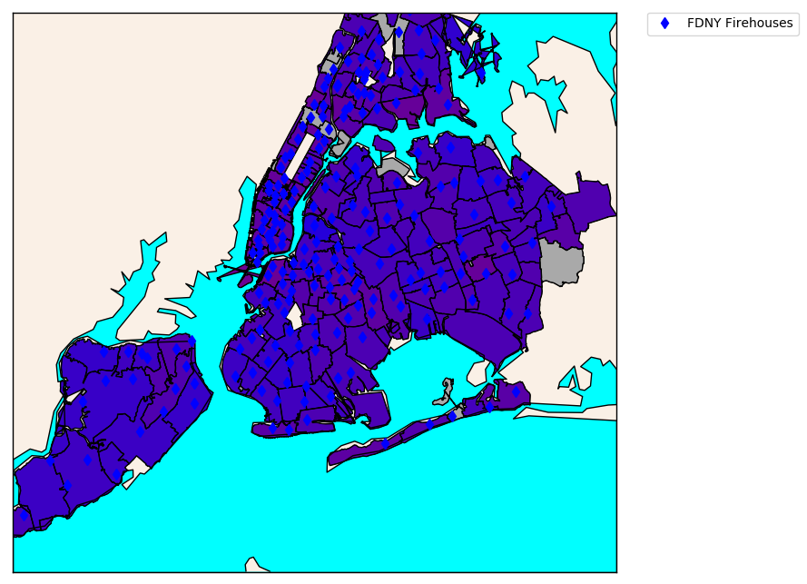

# CITY LEARNING (ML)

## What this is

A personal project based on several open data sets and its effects on various US cities.
The program is also trained with [Keras](https://keras.io/) neural networks in order
to model and predict these behaviours.  

_Note_: Most data files are not showing on this Github repository due to their size.

## What this is NOT

* A predictive analytics tool
* A python module
* An interactive visualization

## _Cities and Projects Available_

**New York** : Encompasses Manhattan and surrounding parts of the 5 boroughs. Southern Staten Island and
            eastern Queens are not completely shown in the map.  
            Topic: Fire emergencies and building inspections.

## Results

#### **New York**

1. Probability of passing inspection by area

