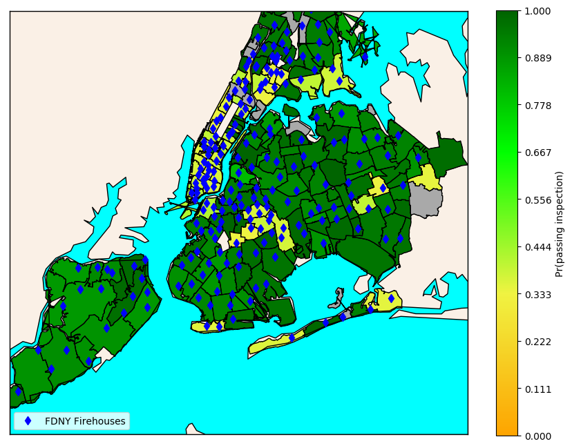

# CITY LEARNING (ML)

## What this is

A personal project based on several open data sets and its effects on various US cities.
The program is also trained with [Keras](https://keras.io/) neural networks in order
to model and predict these behaviours.  

_Note_: Most data files are not showing on this Github repository due to their size.

## What this is NOT

* A predictive analytics tool
* A python module
* An interactive visualization

## _Cities and Projects Available_

**New York**   
Encompasses Manhattan and surrounding parts of the 5 boroughs. Southern Staten Island and
eastern Queens are not completely shown in the map.  
* Probability of passing inspection by area
* Parking fines vs. Health concerns  
		Both the car brand and price are taken into consideration and computed from the Seattle city fleet sold vehicle data.

## Results

#### **New York**

1. Probability of passing inspection by area
  

#### Data References  
1.
	* [FDNY Firehouse Listing](https://data.cityofnewyork.us/Public-Safety/FDNY-Firehouse-Listing/hc8x-tcnd)
	* [NYC Bureau of Fire Prevention - Inspections](https://data.cityofnewyork.us/Public-Safety/Bureau-of-Fire-Prevention-Inspections/ssq6-fkht)
	
2.
	* [Seattle Sold Fleet Equipment](https://data.seattle.gov/City-Business/Sold-Fleet-Equipment/y6ef-jf2w)
	* [NY Rodent Inspection]
	* [Seattle Sold Fleet Equipment](https://data.seattle.gov/City-Business/Sold-Fleet-Equipment/y6ef-jf2w)